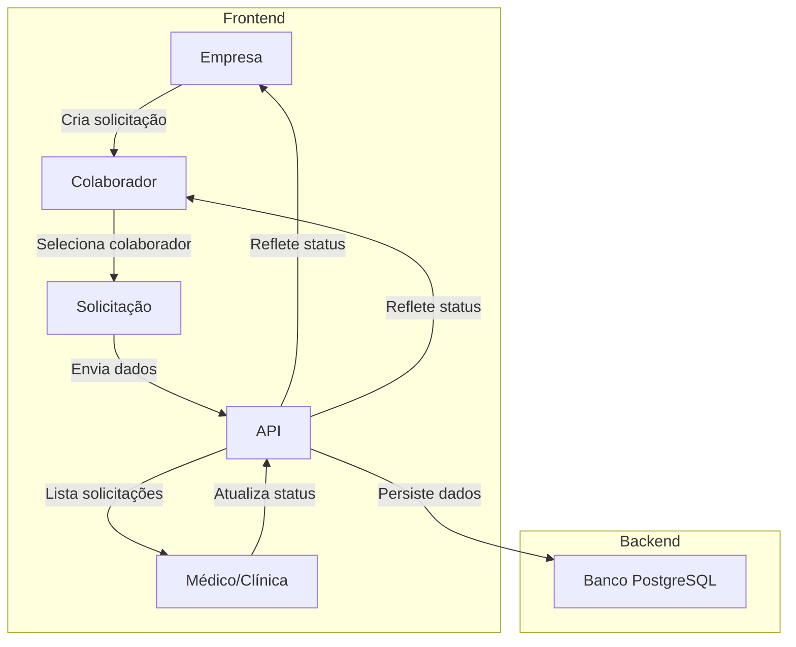

# Design da Fase 2 - Implementação

## Arquitetura de Fluxo de Dados



---

## Componentes (Frontend)

### Colaboradores
- `InviteSignupPage`: Página de cadastro via convite.
- `EmployeeDashboard`: Exibe solicitações do colaborador.

### Empresas
- `CompanySignupPage`: Cadastro de empresa.
- `RequestForm`: Criação de solicitações.
- `CompanyDashboard`: Visualização de solicitações dos colaboradores.

### Agendamentos/Solicitações
- `AppointmentsTable`: Tabela de solicitações (dados reais da API).
- `ScheduleCalendar`: Calendário de agendamentos (dados reais da API).

### Médicos/Clínica
- `DoctorDashboard`: Lista de solicitações recebidas.
- `RequestDetail`: Detalhes e atualização de status da solicitação.

---

## Schema do Banco de Dados

### Tabelas Principais

#### `empresas`
```sql
CREATE TABLE empresas (
    id SERIAL PRIMARY KEY,
    nome VARCHAR(255) NOT NULL,
    cnpj VARCHAR(18) UNIQUE,
    email VARCHAR(255) UNIQUE NOT NULL,
    created_at TIMESTAMP DEFAULT CURRENT_TIMESTAMP
);
```

#### `colaboradores`
```sql
CREATE TABLE colaboradores (
    id SERIAL PRIMARY KEY,
    nome VARCHAR(255) NOT NULL,
    email VARCHAR(255) UNIQUE NOT NULL,
    empresa_id INTEGER REFERENCES empresas(id),
    created_at TIMESTAMP DEFAULT CURRENT_TIMESTAMP
);
```

#### `solicitacoes`
```sql
CREATE TABLE solicitacoes (
    id SERIAL PRIMARY KEY,
    colaborador_id INTEGER REFERENCES colaboradores(id),
    empresa_id INTEGER REFERENCES empresas(id),
    medico_id INTEGER REFERENCES medicos(id),
    tipo VARCHAR(100) NOT NULL, -- exame/consulta
    status VARCHAR(50) DEFAULT 'pendente', -- pendente/em_atendimento/concluido
    created_at TIMESTAMP DEFAULT CURRENT_TIMESTAMP,
    updated_at TIMESTAMP DEFAULT CURRENT_TIMESTAMP
);
```

#### `medicos`
```sql
CREATE TABLE medicos (
    id SERIAL PRIMARY KEY,
    nome VARCHAR(255) NOT NULL,
    email VARCHAR(255) UNIQUE NOT NULL,
    clinica_id INTEGER REFERENCES clinicas(id),
    created_at TIMESTAMP DEFAULT CURRENT_TIMESTAMP
);
```

#### `clinicas`
```sql
CREATE TABLE clinicas (
    id SERIAL PRIMARY KEY,
    nome VARCHAR(255) NOT NULL,
    cnpj VARCHAR(18) UNIQUE,
    created_at TIMESTAMP DEFAULT CURRENT_TIMESTAMP
);
```

---

## APIs (Backend)

### Colaboradores
| Método | Endpoint | Descrição |
|--------|----------|-----------|
| POST | `/colaboradores` | Cria colaborador via convite. |
| GET | `/colaboradores/:id/solicitacoes` | Lista solicitações do colaborador. |

### Empresas
| Método | Endpoint | Descrição |
|--------|----------|-----------|
| POST | `/empresas` | Cadastra empresa. |
| POST | `/empresas/:id/solicitacoes` | Cria solicitação para colaborador. |
| GET | `/empresas/:id/solicitacoes` | Lista solicitações da empresa. |

### Solicitações
| Método | Endpoint | Descrição |
|--------|----------|-----------|
| GET | `/solicitacoes` | Lista solicitações (filtrável por status). |
| PATCH | `/solicitacoes/:id` | Atualiza status da solicitação. |

### Médicos/Clínica
| Método | Endpoint | Descrição |
|--------|----------|-----------|
| GET | `/medicos/:id/solicitacoes` | Lista solicitações do médico. |
