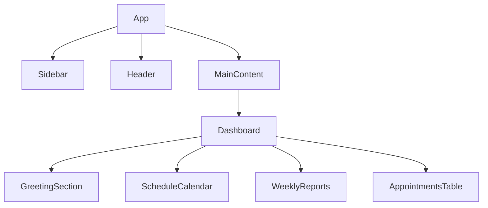

# 🎨 Design: Bloco B1 – Coesão de Layout

## Arquitetura de Componentes


### **Estrutura do Grid (Desktop)**
```
-----------------------------------------
| SIDEBAR (250px) | MAIN CONTENT      |
|                 | ----------------- |
|                 | GREETING (4/12)   |
|                 | SCHEDULE (8/12)   |
|                 | ----------------- |
|                 | REPORTS (12/12)   |
|                 | ----------------- |
|                 | TABLE (12/12)     |
-----------------------------------------
```

### **Componentes Detalhados**

#### 1. **Sidebar**
- **Estrutura**: 
  ```
  ---------------------------------
  | SaudeSeg+ (Logo)                |
  | [Avatar] Dr. Karen Smith        |
  | ---------------------------------|
  | 🏠 Dashboard                    |
  | 👥 Patients                     |
  | 📅 Calendar                    |
  | 📊 Reports                     |
  | 🔧 Configurações                |
  ---------------------------------
  ```
- **Estilos**:
  - Fundo: `#6B46C1` (roxo escuro).
  - Texto: `#FFFFFF` (branco).
  - Hover: `rgba(255, 255, 255, 0.1)`.
  - Ícones: Heroicons (20px × 20px).

---

#### 2. **Header**
- **Estrutura**:
  ```
  -----------------------------------------
  | 🔍 Search...                ▼ Appointments |
  | ---------------------------------------- |
  | Breadcrumb: Home / Dashboard            |
  | [Avatar] Karen Smith 🔔                |
  -----------------------------------------
  ```
- **Estilos**:
  - Fundo: `#FFFFFF` (branco).
  - Sombra: `shadow-sm`.
  - Avatar: `40px` × `40px`, borda `2px solid #3B82F6`.

---

#### 3. **Card**
- **Props**:
  - `title`: string (opcional).
  - `icon`: SVG (opcional).
  - `children`: ReactNode.
  - `footer`: ReactNode (opcional).
- **Exemplo de Uso**:
  ```tsx
  <Card title="Total Patients" icon={<UserGroupIcon />}>580</Card>
  ```
- **Estilos**:
  - Fundo: `#FFFFFF`.
  - Borda: `1px solid #E5E7EB`.
  - Padding: `16px`.

---

### **Quadrantes da Dashboard**

#### **GreetingSection**
- **Conteúdo**:
  - Texto: `Good Morning, Dr. {name}`.
  - Ilustração: SVG de médico (ex: [`<DoctorIllustration />`]).
- **Estilos**:
  - Fundo: `#FFFFFF`.
  - Grid: `4/12` colunas (desktop).

#### **ScheduleCalendar**
- **Estrutura**:
  ```
  ---------------------------------
  | Schedule Calendar ◀ Jun ▶      |
  | Mon | Tue | Wed | Thu | Fri |
  | 23  | 24  | 25🔵| 26  | 27  |
  | Sat | Sun |           |
  | 28  | 29  |           |
  ---------------------------------
  ```
- **Estilos**:
  - Fundo do header: `rgba(59, 130, 246, 0.1)`.
  - Dia ativo: `#3B82F6` (azul).

#### **WeeklyReports**
- **Cards**:
  | Card               | Valor Mockado |
  |--------------------|----------------|
  | Total Patients    | 580            |
  | Phone Calls       | 356            |
  | Appointments      | 288            |
  | Unread Mail       | 5              |
- **Grid**: `3/12` colunas cada card (desktop).

#### **AppointmentsTable**
- **Colunas**:
  - **Name**: Avatar + nome.
  - **Location**: Texto + ícone de localização.
  - **Date/Time**: Data e horário.
  - **Status**: Badge colorido (`#3B82F6` para confirmado, `#F59E0B` para pendente).
- **Estilos**:
  - Zebra-striping: `background-color: #F9FAFB` nas linhas pares.
  - Hover: `rgba(59, 130, 246, 0.05)`.

---

## Decisões de Design

| Decisão                     | Motivo                                                                 |
|-----------------------------|------------------------------------------------------------------------|
| Usar `tailwindcss`          | Consistência com o projeto existente + agilidade no desenvolvimento. |
| Ícones SVG inline           | Performance (evitar requests adicionais).                             |
| Ilustrações estáticas       | Reduzir complexidade (MVP).                                            |
| Paleta de cores restrita     | Manter identidade visual coesa.                                        |
| Componentes modulares       | Reutilização em outras telas (ex: Patients, Reports).                  |

---

## Referências Visuais
- **Inspiração**: [Image 1] (dashboard médico).
- **Ferramenta**: [Tailwind Cheat Sheet](https://nerdcave.com/tailwind-cheat-sheet).