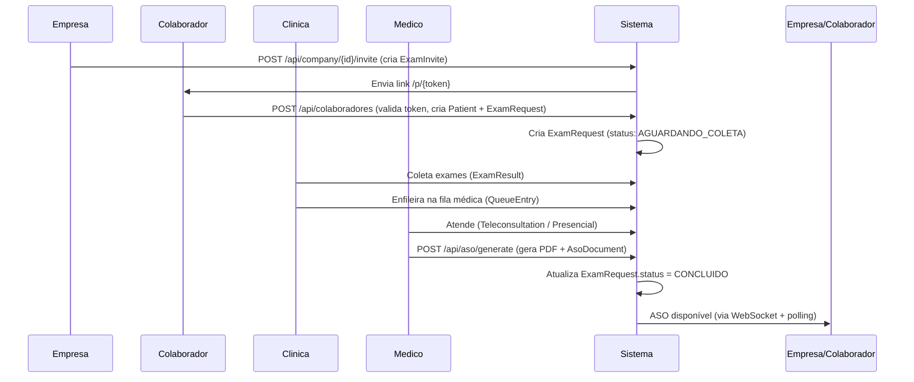

# Especificação de Arquitetura e Análise de Impacto — Protocolo ASO

## 1. Visão Geral da Arquitetura Atual

### 1.1 Estrutura do Monorepo (Turborepo)
```
/e/BerithCod/SaudeSegPlus_clean/
├── apps/
│   ├── backend/          # NestJS 11 + Prisma + PostgreSQL (Supabase)
│   └── web/              # Next.js 14 (App Router) + Tailwind
├── packages/             # Libs compartilhadas (se houver)
└── libs/                 # Templates PDF, etc.
```

### 1.2 Módulos Backend Existentes (apps/backend/src/)

| Módulo | Responsabilidade | Principais Entidades Prisma |
|--------|------------------|----------------------------|
| `auth` | JWT, guards, roles | `UserAccount` |
| `company` | Empresas, convites, ASOs ativos | `Company`, `ExamInvite`, `AsoDocument` |
| `clinic-profile` | Perfil da clínica, operadores, ASOs da clínica | `Clinic`, `Operator` |
| `exam-request` | Solicitações de exame, fila, status | `ExamRequest`, `ExamResult`, `QueueEntry` |
| `aso` | Geração de PDF ASO (somente médicos) | `AsoDocument` |
| `colaborador` | Cadastro de colaborador via convite | `Patient`, `CompanyPatientRelation` |
| `medicos` | Perfil médico, agenda | `Doctor` |
| `financial` | Pagamentos, transações, precificação | `Payment`, `FinancialTransaction`, `ServicePrice` |
| `upload` | Supabase Storage (documentos, ASOs) | - |
| `calendar` | Agenda de exames | `CalendarEvent` |
| `teleconsultation` | Videochamadas | `Teleconsultation` |
| `anamnese` | Anamnese ocupacional | `Anamnese` |
| `presence` | Presença online | - |
| `queue` | Fila de atendimento médico | `QueueEntry` |
| `support` | Chamados de suporte | `SupportTicket` |
| `admin` | Painel admin global | - |

### 1.3 Fluxo Atual do Processo ASO (End-to-End)



---

## 2. Entidades Prisma Relacionadas ao Fluxo Atual

### 2.1 Entidades Principais (já existentes)

```prisma
// Solicitação de exame — CENTRAL no fluxo atual
model ExamRequest {
  id                    String       @id @default(uuid())
  patientId             String
  clinicId              String?
  inviteId              String?      @unique
  source                String       @default("direto")
  examPurpose           String       // "admissional", "periodico", etc.
  status                String       // AGUARDANDO_COLETA, EM_COLETA, NA_FILA_MEDICA, EM_ATENDIMENTO, CONCLUIDO
  createdAt             DateTime     @default(now())
  updatedAt             DateTime     @updatedAt
  asoDocuments          AsoDocument[]
  queueEntry            QueueEntry?
  // ... relações
}

// Documento ASO assinado/emitido
model AsoDocument {
  id                  String      @id @default(uuid())
  requestId           String
  doctorId            String
  decision            String      // APTO, INAPTO, APTO_COM_RESTRICOES
  restrictionNotes    String?
  pdfUrl              String?
  signatureProviderId String?
  signedAt            DateTime?
  validUntil          DateTime?
  doctor              Doctor      @relation(fields: [doctorId], references: [id])
  request             ExamRequest @relation(fields: [requestId], references: [id])
}

// Convite da empresa para colaborador
model ExamInvite {
  id                  String              @id @default(uuid())
  token               String              @unique @default(uuid())
  companyId           String
  clinicId            String?
  expectedCpf         String?
  expectedEmail       String?
  roleFunction        String
  roleFunctionCboCode String?
  examType            String              // "admissional", "periodico", etc.
  status              InviteStatus        @default(ENVIADO)
  expiresAt           DateTime
  examRequest         ExamRequest?        // vincula ao ExamRequest quando colaborador cadastra
  timelineEvents      ExamTimelineEvent[]
  payment             Payment?
}

// Eventos de timeline (append-only)
model ExamTimelineEvent {
  id            String            @id @default(uuid())
  inviteId      String?
  examRequestId String?
  eventType     TimelineEventType // LINK_ENVIADO, CADASTRO_CONCLUIDO, COLETA_INICIADA, EM_FILA_MEDICA, CONCLUIDO
  occurredAt    DateTime          @default(now())
  metadata      String?
  examRequest   ExamRequest?
  invite        ExamInvite?
}

// Fila médica
model QueueEntry {
  id               String      @id @default(uuid())
  requestId        String      @unique
  enteredQueueAt   DateTime    @default(now())
  priorityScore    Int         @default(0)
  assignedDoctorId String?
  assignedAt       DateTime?
  status           String      @default("WAITING")
  request          ExamRequest @relation(fields: [requestId], references: [id])
}
```

### 2.2 O que FALTA para o "Protocolo Único"

| Conceito Atual | Limitação | O que o Protocolo Resolve |
|----------------|-----------|---------------------------|
| `ExamRequest` | 1 por exame, mas não agrupa o processo completo | Protocolo = 1 número que acompanha tudo |
| `ExamInvite` | Inicia o processo, mas não tem rastreio unificado | Protocolo criado na abertura do pedido |
| `ExamTimelineEvent` | Apenas eventos operacionais, sem histórico de alterações de dados | Histórico completo (quem alterou o quê, quando) |
| `AsoDocument` | Só existe no final, não rastreia documentos intermediários | `documentos` JSON array com todos os anexos |
| Busca | Só por ID interno ou filtros em `ExamRequest` | Busca por **número de protocolo legível** (`ASO-2026-0001`) |

---

## 3. Análise de Impacto — Módulos Afetados

### 3.1 Módulos que PRECISAM de Mudança (Alta Prioridade)

| Módulo | Impacto | Tipo de Mudança |
|--------|---------|-----------------|
| **Prisma Schema** | Nova model `ProcessoASO` + enums | **Migration obrigatória** |
| **Backend: Novo módulo `aso-protocolo`** | CRUD completo do protocolo | **Novo módulo** (não quebra existente) |
| **Backend: `company` module** | Listar ASOs por protocolo, buscar por nº protocolo | Adicionar métodos no service + endpoints |
| **Backend: `clinic-profile` module** | Listar ASOs da clínica por protocolo | Adicionar métodos no service |
| **Backend: `exam-request` module** | Vincular `ExamRequest` ao `ProcessoASO` | Adicionar `processoAsoId` opcional em `ExamRequest` |
| **Backend: `colaborador` module** | Ao criar `ExamRequest`, criar/associar `ProcessoASO` | Modificar `validateInviteAndRegister` |
| **Backend: `aso` module** | Ao gerar ASO, atualizar `ProcessoASO` (documentos, status) | Modificar `generatePdf` |
| **Frontend: `web/app/empresa/asos/page.tsx`** | Adicionar coluna "Protocolo", busca por protocolo | UI update |
| **Frontend: `web/app/consultorio/asos/page.tsx`** | Idem clínica | UI update |
| **Frontend: `web/app/consultorio/exames/[id]/page.tsx`** | Mostrar protocolo no detalhe do exame | UI update |

### 3.2 Módulos que PODEM ser Afetados (Média Prioridade)

| Módulo | Impacto | Tipo de Mudança |
|--------|---------|-----------------|
| `financial` | Transações financeiras poderiam referenciar `ProcessoASO` | Opcional: adicionar `processoAsoId` em `FinancialTransaction` |
| `calendar` | Eventos de calendário poderiam mostrar nº protocolo | Opcional |
| `teleconsultation` | Sala de vídeo poderia exibir protocolo | Opcional |
| `support` | Chamados de suporte poderiam referenciar protocolo | Opcional |
| `admin` | Dashboard admin com estatísticas por protocolo | Novo endpoint em `aso-protocolo` |

### 3.3 Módulos NÃO Afetados (Baixa Prioridade)

| Módulo | Motivo |
|--------|--------|
| `auth` | Apenas autenticação, sem lógica de negócio ASO |
| `medicos` | Perfil médico, agenda — não toca no fluxo ASO |
| `anamnese` | Dados clínicos do paciente — independente |
| `presence` | Status online — independente |
| `queue` | Fila médica — usa `ExamRequest`, não protocolo |
| `upload` | Storage genérico — não muda |
| `jobs` | Jobs assíncronos — não muda |
| `mail` | Emails — pode ser estendido para notificar protocolo |

---

## 4. Estratégia de Implementação Suave (Zero Breaking Changes)

### 4.1 Princípios

1. **Novo módulo isolado**: `aso-protocelo` com suas próprias rotas (`/api/aso/protocolos/*`)
2. **Campos opcionais**: `processoAsoId` em `ExamRequest` é **opcional** (nullable)
3. **Migração de dados**: Backfill opcional para processos existentes (job separado)
4. **Compatibilidade**: Endpoints existentes (`/api/solicitacoes`, `/api/company/{id}/asos`) continuam funcionando igual
5. **Feature flag**: `ENABLE_PROTOCOLO_ASO` para ativar/desativar gradualmente

### 4.2 Ordem de Execução Segura

```mermaid
graph TD
    A[1. Prisma Schema + Migration] --> B[2. Novo Módulo aso-protocolo]
    B --> C[3. Adicionar processoAsoId opcional em ExamRequest]
    C --> D[4. Atualizar ColaboradorService (criar protocolo no cadastro)]
    D --> E[5. Atualizar AsoService (atualizar protocolo na geração)]
    E --> F[6. Atualizar CompanyService (listar/buscar por protocolo)]
    F --> G[7. Atualizar ClinicProfileService]
    G --> H[8. Frontend: Busca por protocolo + coluna na listagem]
    H --> I[9. Frontend: Página de detalhes do protocolo]
    I --> J[10. Backfill opcional de dados legados]
    J --> K[11. Testes E2E + Feature Flag ON]
```

---

## 5. Especificação Técnica Detalhada

### 5.1 Prisma Schema — Nova Model

```prisma
// Adicionar ao schema.prisma existente

model ProcessoASO {
  id              String    @id @default(uuid())
  numeroProtocolo String    @unique @map("numero_protocolo")
  empresaId       String    @map("empresa_id")
  clinicaId       String?   @map("clinica_id")
  pacienteId      String    @map("paciente_id")
  medicoId        String?   @map("medico_id")
  examRequestId   String?   @unique @map("exam_request_id")
  status          StatusProtocolo @default(AGUARDANDO_COLETA)
  tipoExame       TipoExame @map("tipo_exame")
  dataAbertura    DateTime  @default(now()) @map("data_abertura")
  dataConclusao   DateTime? @map("data_conclusao")
  documentos      Json      @default("[]") // [{id, tipo, url, data, descricao}]
  historico       Json      @default("[]") // [{acao, de, para, userId, timestamp}]
  observacoes     String?
  createdAt       DateTime  @default(now()) @map("created_at")
  updatedAt       DateTime  @updatedAt @map("updated_at")

  @@index([empresaId])
  @@index([clinicaId])
  @@index([pacienteId])
  @@index([medicoId])
  @@index([status])
  @@index([numeroProtocolo])
  @@map("processos_aso")
}

enum StatusProtocolo {
  AGUARDANDO_COLETA
  EM_COLETA
  NA_FILA_MEDICA
  EM_ATENDIMENTO
  DOCUMENTOS_PENDENTES
  CONCLUIDO
  CANCELADO
}

enum TipoExame {
  ADMISSIONAL
  PERIODICO
  DEMISSIONAL
  MUDANCA_FUNCAO
  RETORNO_TRABALHO
}

// Em ExamRequest, adicionar campo opcional:
model ExamRequest {
  // ... campos existentes ...
  processoAsoId   String?   @unique @map("processo_aso_id")
  processoAso     ProcessoASO? @relation(fields: [processoAsoId], references: [id])
  // ...
}
```

### 5.2 Backend — Novo Módulo `aso-protocolo`

```
apps/backend/src/aso-protocolo/
├── dto/
│   ├── create-protocolo.dto.ts
│   ├── update-protocolo.dto.ts
│   └── protocolo-query.dto.ts
├── aso-protocolo.controller.ts
├── aso-protocolo.service.ts
├── aso-protocelo.module.ts
└── index.ts
```

**Endpoints REST:**

| Método | Rota | Descrição | Guards |
|--------|------|-----------|--------|
| POST | `/api/aso/protocolos` | Criar protocolo | `JwtAuthGuard`, `Roles(CLINIC, COMPANY_ADMIN)` |
| GET | `/api/aso/protocolos` | Listar com filtros/paginação | `JwtAuthGuard`, `Roles(ADMIN, CLINIC, COMPANY_ADMIN, DOCTOR)` |
| GET | `/api/aso/protocolos/busca/:numeroProtocolo` | Buscar por nº protocolo (público p/ link) | `JwtAuthGuard` (opcional) |
| GET | `/api/aso/protocolos/:id` | Detalhes completos | `JwtAuthGuard` |
| PUT | `/api/aso/protocolos/:id` | Atualizar status, médico, docs, obs | `JwtAuthGuard`, `Roles(CLINIC, DOCTOR, COMPANY_ADMIN)` |
| DELETE | `/api/aso/protocolos/:id` | Cancelar (soft delete) | `JwtAuthGuard`, `Roles(CLINIC, COMPANY_ADMIN)` |
| GET | `/api/aso/protocolos/estatisticas` | Dashboard counts por status/tipo | `JwtAuthGuard`, `Roles(ADMIN, CLINIC, COMPANY_ADMIN)` |

### 5.3 Integração com Módulos Existentes

#### 5.3.1 `ColaboradorService.validateInviteAndRegister()`
```typescript
// DEPOIS da criação do ExamRequest:
const protocolo = await this.asoProtocoloService.create({
  empresaId: invite.companyId,
  clinicaId: invite.clinicId ?? examRequest.clinicId,
  pacienteId: patient.id,
  tipoExame: this.mapExamType(invite.examType), // string -> TipoExame enum
}, req.user.id);

// Vincular ao ExamRequest
await this.prisma.examRequest.update({
  where: { id: examRequest.id },
  data: { processoAsoId: protocolo.id },
});
```

#### 5.3.2 `AsoService.generatePdf()`
```typescript
// DEPOIS da geração do PDF e criação do AsoDocument:
if (request.processoAsoId) {
  await this.asoProtocoloService.update(request.processoAsoId, {
    status: StatusProtocolo.CONCLUIDO,
    medicoId: doctor.id,
    documentos: [...existingDocs, { id: asoDoc.id, tipo: 'ASO', url: fileUrl, data: new Date().toISOString() }],
  }, req.user.id);
}
```

#### 5.3.3 `ExamRequestService.updateStatus()`
```typescript
// Quando status muda, sincronizar com protocolo
if (request.processoAsoId) {
  const statusMap: Record<string, StatusProtocolo> = {
    'AGUARDANDO_COLETA': StatusProtocolo.AGUARDANDO_COLETA,
    'EM_COLETA': StatusProtocolo.EM_COLETA,
    'NA_FILA_MEDICA': StatusProtocolo.NA_FILA_MEDICA,
    'EM_ATENDIMENTO': StatusProtocolo.EM_ATENDIMENTO,
    'CONCLUIDO': StatusProtocolo.CONCLUIDO,
  };
  if (statusMap[body.status]) {
    await this.asoProtocoloService.update(request.processoAsoId, {
      status: statusMap[body.status],
    }, userId);
  }
}
```

#### 5.3.4 `CompanyService.listActiveAsos()` / `ClinicProfileService.listClinicAsos()`
```typescript
// Adicionar numeroProtocolo no retorno
return asos.map((aso) => ({
  ...existingFields,
  numeroProtocolo: aso.request.processoAso?.numeroProtocolo ?? null,
  processoAsoId: aso.request.processoAsoId ?? null,
}));
```

### 5.4 Frontend — Mudanças Mínimas

#### 5.4.1 Types (`apps/web/app/lib/types/aso-protocolo.ts`)
```typescript
export type StatusProtocolo = 'AGUARDANDO_COLETA' | 'EM_COLETA' | 'NA_FILA_MEDICA' | 
  'EM_ATENDIMENTO' | 'DOCUMENTOS_PENDENTES' | 'CONCLUIDO' | 'CANCELADO';

export type TipoExame = 'ADMISSIONAL' | 'PERIODICO' | 'DEMISSIONAL' | 'MUDANCA_FUNCAO' | 'RETORNO_TRABALHO';

export interface ProtocoloASO {
  id: string;
  numeroProtocolo: string;
  empresaId: string;
  clinicaId?: string;
  pacienteId: string;
  medicoId?: string;
  examRequestId?: string;
  status: StatusProtocolo;
  tipoExame: TipoExame;
  dataAbertura: string;
  dataConclusao?: string;
  documentos: Documento[];
  historico: HistoricoItem[];
  observacoes?: string;
  empresa?: { id: string; nome: string };
  clinica?: { id: string; nome: string };
  paciente?: { id: string; nome: string; cpf: string };
  medico?: { id: string; nome: string; crm: string };
}
```

#### 5.4.2 API Client (`apps/web/app/lib/api/aso-protocolo.ts`)
```typescript
export const asoProtocoloApi = {
  create: (data: CreateProtocoloDto) => apiFetch('/api/aso/protocolos', { method: 'POST', body: JSON.stringify(data) }),
  list: (params: ProtocoloQueryDto) => apiFetch(`/api/aso/protocolos?${new URLSearchParams(params)}`),
  getByNumero: (numero: string) => apiFetch(`/api/aso/protocolos/busca/${numero}`),
  getById: (id: string) => apiFetch(`/api/aso/protocolos/${id}`),
  update: (id: string, data: UpdateProtocoloDto) => apiFetch(`/api/aso/protocolos/${id}`, { method: 'PUT', body: JSON.stringify(data) }),
  delete: (id: string) => apiFetch(`/api/aso/protocolos/${id}`, { method: 'DELETE' }),
  stats: (empresaId?: string, clinicaId?: string) => apiFetch(`/api/aso/protocolos/estatisticas?empresaId=${empresaId}&clinicaId=${clinicaId}`),
};
```

#### 5.4.3 Páginas Novas
```
apps/web/app/(dashboard)/aso/
├── protocolos/
│   ├── page.tsx                    # Listagem com filtros + busca por nº protocolo
│   ├── novo/
│   │   └── page.tsx                # Criar protocolo manual (clínica/empresa)
│   ├── busca/
│   │   └── page.tsx                # Busca pública por nº protocolo
│   └── [id]/
│       ├── page.tsx                # Detalhes completos (histórico, docs, ações)
│       └── editar/
│           └── page.tsx            # Editar status, médico, obs, anexar docs
```

#### 5.4.4 Atualizações em Páginas Existentes
| Arquivo | Mudança |
|---------|---------|
| `web/app/empresa/asos/page.tsx` | Adicionar coluna "Protocolo", filtro por nº protocolo |
| `web/app/consultorio/asos/page.tsx` | Idem |
| `web/app/consultorio/exames/[id]/page.tsx` | Exibir `numeroProtocolo` se existir |

---

## 6. Plano de Testes

### 6.1 Testes Unitários (Backend)
- [ ] `AsoProtoceloService.create()` — gera nº protocolo único, cria histórico inicial
- [ ] `AsoProtoceloService.update()` — atualiza status, adiciona ao histórico, não permite status inválido
- [ ] `AsoProtoceloService.findByNumeroProtocolo()` — busca case-insensitive
- [ ] Validação de transições de status (ex: não pode ir de CONCLUIDO para AGUARDANDO_COLETA)

### 6.2 Testes de Integração
- [ ] Fluxo completo: Convite → Cadastro Colaborador → ExamRequest → Protocolo criado automaticamente
- [ ] Geração ASO → Protocolo atualizado para CONCLUIDO + documento anexado
- [ ] Cancelamento protocolo → Soft delete + histórico registrado
- [ ] Busca por nº protocolo retorna todos os dados (empresa, clínica, paciente, médico, docs, histórico)

### 6.3 Testes E2E (Frontend)
- [ ] Empresa busca ASO por nº protocolo → vê detalhes completos
- [ ] Clínica altera status de EM_COLETA → EM_ATENDIMENTO → CONCLUIDO
- [ ] Médico gera ASO → protocolo aparece como CONCLUIDO com PDF anexado
- [ ] Paginação e filtros na listagem funcionam

---

## 7. Rollback Plan

Se algo der errado em produção:

1. **Feature Flag OFF**: `ENABLE_PROTOCOLO_ASO=false` → novo módulo desabilitado, rotas retornam 404
2. **Migration Reversível**: `npx prisma migrate resolve --rolled-back "add_processo_aso"` (se migration não aplicada em prod)
3. **Dados**: Nova tabela `processos_aso` é isolada — não toca em tabelas existentes
4. **Frontend**: Páginas novas sob `/aso/protocolos/*` — não afetam rotas existentes

---

## 8. Checklist de Entrega

| Item | Status | Responsável |
|------|--------|-------------|
| [ ] Prisma migration `add_processo_aso` criada e testada local | ⬜ | Backend |
| [ ] Módulo `aso-protocolo` com CRUD + testes unitários | ⬜ | Backend |
| [ ] Integração `ColaboradorService` → cria protocolo auto | ⬜ | Backend |
| [ ] Integração `AsoService` → atualiza protocolo na geração | ⬜ | Backend |
| [ ] Integração `ExamRequestService` → sincroniza status | ⬜ | Backend |
| [ ] Integração `CompanyService` / `ClinicProfileService` → expõe nº protocolo | ⬜ | Backend |
| [ ] Types + API Client frontend | ⬜ | Frontend |
| [ ] Página listagem `/aso/protocolos` com filtros | ⬜ | Frontend |
| [ ] Página busca `/aso/protocolos/busca` | ⬜ | Frontend |
| [ ] Página detalhes `/aso/protocolos/[id]` | ⬜ | Frontend |
| [ ] Página edição `/aso/protocolos/[id]/editar` | ⬜ | Frontend |
| [ ] Atualização páginas existentes (empresa/consultório ASOs) | ⬜ | Frontend |
| [ ] Testes E2E fluxo completo | ⬜ | QA |
| [ ] Deploy staging + validação | ⬜ | DevOps |
| [ ] Feature flag ON em produção | ⬜ | Release |

---

## 9. Decisões Arquiteturais Registradas

| Decisão | Justificativa |
|---------|---------------|
| Novo módulo `aso-protocolo` separado | Isola responsabilidade, não quebra módulos existentes, testável independentemente |
| `processoAsoId` opcional em `ExamRequest` | Migração gradual — processos legados continuam funcionando sem protocolo |
| Número de protocolo `ASO-YYYY-NNNN` | Legível, ordenável, único por ano — facilita comunicação humana |
| Histórico imutável em JSON | Simplicidade (sem tabela extra), performance OK para consulta, auditoria completa |
| Status `DOCUMENTOS_PENDENTES` | Caso real: ASO assinado mas faltando exames/laudos anexos — evita "CONCLUIDO" prematuro |
| Busca por nº protocolo sem auth opcional | Permite link público de verificação (ex: colaborador envia para RH) |

---

*Documento gerado em 2026-07-17 — Baseado na análise do código em `/e/BerithCod/SaudeSegPlus_clean`*